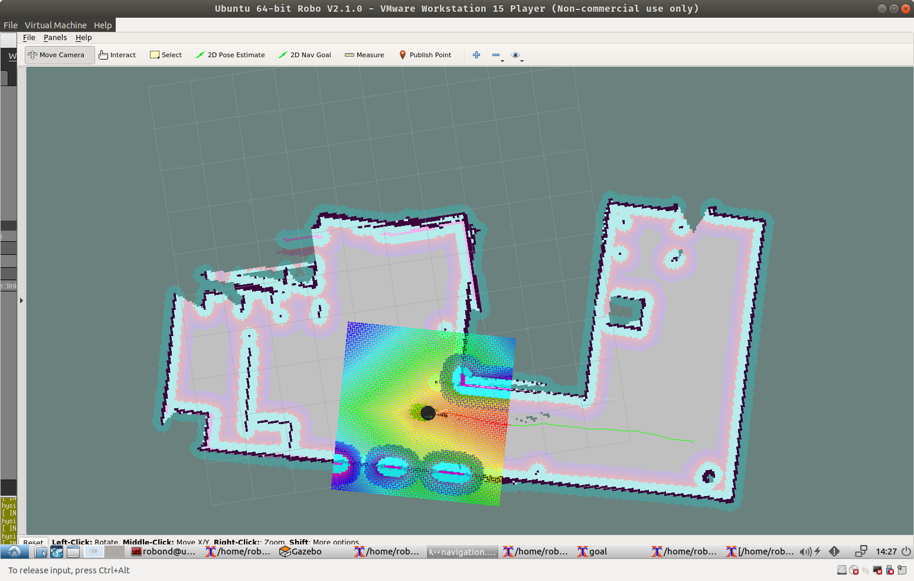

# Robotics-ND
## Udacity Robotics Nanodegree

Projects for Robotics Software Nanodegree.

Here are the projects:

### Project 1 - My World
A simulated world for the robot built using Gazebo in ROS

### Project 2 - Go Chase It
A robot created using URDF format, with Lidar and Camera sensors. A node `ball_chaser` implemented in C++ that responds to make the robot change its linear velocities (get closer to a white ball)

### Project 3 - Where Am I

Utilizes ROS AMCL package to accurately localize a mobile robot inside a map in the Gazebo simulation environments. Here are the steps to learn several aspects of robotic software engineering with a focus on ROS:

    Create a ROS package that launches a custom robot model in a custom Gazebo world
    Utilize the ROS AMCL package and the Tele-Operation / Navigation Stack to localize the robot
    Explore, add, and tune specific parameters corresponding to each package to achieve the best possible localization results

### Project 4 - Map My World

In this project you will create a 2D occupancy grid and 3D octomap from a simulated environment using your own robot with the RTAB-Map package.
RTAB-Map (Real-Time Appearance-Based Mapping) is a popular solution for SLAM to develop robots that can map environments in 3D. RTAB-Map has good speed and memory management, and it provides custom developed tools for information analysis. Most importantly, the quality of the documentation on ROS Wiki (http://wiki.ros.org/rtabmap_ros) is very high. Being able to leverage RTAB-Map with your own robots will lead to a solid foundation for mapping and localization well beyond this Nanodegree program.
For this project we will be using the rtabmap_ros package, which is a ROS wrapper (API) for interacting with RTAB-Map. Keep this in mind when looking at the relative documentation.

    You will develop your own package to interface with the rtabmap_ros package.
    You will build upon your localization project to make the necessary changes to interface the robot with RTAB-Map. An example of this is the addition of an RGB-D camera.
    You will ensure that all files are in the appropriate places, all links are properly connected, naming is properly setup and topics are correctly mapped. Furthermore you will need to generate the appropriate launch files to launch the robot and map its surrounding environment.
    When your robot is launched you will teleop around the room to generate a proper map of the environment.

### Project 5 - Home Service Robot

Final project that implements a Home Service Robot - that moves to goal #1 to pick up an item, then drops it off at another location, goal #2. 
Uses AMCL package for localization and navigation to a goal, and timed messages to simulate pickup and drop-off.

**Projects**: 

- Project-1: [My World](https://github.com/laventura/robond)
- Project-2: [Go Chase It](P2-GoChaseIt)
- Project-3: [Where Am I](P3-Where)
- Project-4: [Map My World](P4-MapMyWorld)
- Project-5: [Home Service Robot](P5-HomeServiceRobot)

